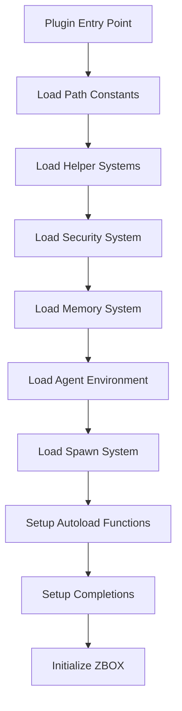

# ZBOX Plugin Architecture Guide

## Overview

Your ZBOX project is an enterprise-grade AI shell environment with sophisticated plugin architecture. Here's how it all works together:

## 🏗️ Architecture Layers

### 1. **Core Plugin Layer** (`zbox-agent-environment.plugin.zsh`)
- **Main entry point** that orchestrates the entire system
- **Dependency management** - loads modules in correct order
- **Plugin lifecycle** - initialization, reload, cleanup
- **Error handling** - graceful degradation when components fail

### 2. **Configuration Layer** (`config/`)
- `zbox_path_constants.zsh` - Central path management
- Environment-specific settings
- User configuration overrides

### 3. **Helper System Layer** (`functions/helper/`)
```
functions/helper/
├── system_helpers.zsh          # System utilities (load first)
├── validation_helpers.zsh      # Input validation (load second) 
├── security_helpers.zsh        # Security functions (load third)
├── logging_helpers.zsh         # Logging system (load fourth)
├── file_helpers.zsh           # File operations
├── network_helpers.zsh        # Network utilities
├── parsing_helpers.zsh        # Data parsing
├── input_helpers.zsh          # Input handling
├── output_helpers.zsh         # Output formatting
├── model_helpers.zsh          # Model management
├── agent_helpers.zsh          # Agent orchestration
├── memory_helpers.zsh         # Memory management
└── hydration_helpers.zsh      # Data hydration
```

### 4. **Memory System Layer** (`functions/memory/`)
- `zbox_memory_management_system.zsh` - Core memory management
- `zbox_memory_advanced_system.zsh` - Advanced memory features
- `zbox_memory_integration_wrapper.zsh` - Integration layer
- `zbox_postgreSQL_memory_interface.py` - Database interface

### 5. **Security Layer** (`zbox_security_system.zsh`)
- Authentication and authorization
- Session security
- API key management

### 6. **Agent Environment Layer** (`zbox_agent_environment-v1.zsh`)
- Main agent orchestration logic
- Model switching and management
- Chat interface and formatting

### 7. **Infrastructure Layer**
- `Dockerfile.zbox` - Containerization
- `zbox-deployment.yml` - Kubernetes/Docker deployment
- `migrations/zbox_postgreSQL_memory.sql` - Database schema

## 🔄 Plugin Loading Sequence



## 🎯 Key Plugin Concepts in Your Architecture

### 1. **Modular Loading**
```bash
# Your plugin loads modules in dependency order
zbox_load_helpers           # Foundation utilities
zbox_load_security_system   # Security layer
zbox_load_memory_system     # Memory management
zbox_load_agent_environment # Main agent logic
zbox_load_spawn_system      # Instance spawning
```

### 2. **Helper System Pattern**
Each helper module provides specialized functionality:
- **Separation of concerns** - each module has a single responsibility
- **Dependency management** - modules load in correct order
- **Error isolation** - if one helper fails, others continue

### 3. **Memory Architecture**
Your memory system is particularly sophisticated:
- **Management Layer** - Core memory operations
- **Advanced Layer** - Complex memory features
- **Integration Layer** - Connects to external systems
- **PostgreSQL Interface** - Persistent storage

### 4. **Security Integration**
- **Authentication** built into the plugin loading process
- **Session management** integrated with memory system
- **API key generation** and validation

### 5. **Agent Orchestration**
- **Multi-model support** - primary, secondary, code, web_search
- **Fallback mechanisms** - try agents in sequence
- **Context preservation** - maintain conversation state

## 🚀 Plugin Installation Methods

### Method 1: Oh My Zsh Custom Plugin
```bash
# Clone to Oh My Zsh custom plugins
git clone your-repo ~/.oh-my-zsh/custom/plugins/zbox

# Add to .zshrc
plugins=(... zbox)

# Reload
source ~/.zshrc
```

### Method 2: Manual Installation
```bash
# Clone anywhere
git clone your-repo ~/zbox-plugin

# Add to .zshrc
source ~/zbox-plugin/zbox-agent-environment.plugin.zsh

# Reload
source ~/.zshrc
```

### Method 3: Plugin Manager (zinit)
```bash
# Add to .zshrc
zinit load "username/zbox-plugin"
```

## 🔧 Configuration Options

### Environment Variables
```bash
export ZBOX_HOME="/opt/zbox"                    # Installation path
export ZBOX_AUTO_PROMPT=1                       # Enable custom prompt
export ZBOX_QUIET=0                            # Show loading messages
export ZBOX_TRACK_CONTEXT=1                     # Enable directory tracking
export ZBOX_AGENTS="primary,secondary,code"     # Available agents
export ZBOX_MODEL="primary"                     # Default model
```

### User Configuration File
```bash
# ~/.zboxrc or $ZBOX_USER_HOME/.zboxrc
export ZBOX_MODEL="code"
export ZBOX_CUSTOM_PROMPT=1
alias myai="zbox_chat"
```

## 🐳 Containerization Support

Your architecture includes excellent containerization:

### Dockerfile Structure
- Multi-stage build process
- Security hardening
- Optimized layer caching

### Kubernetes Deployment
- Scalable deployment configuration
- Service discovery
- Configuration management

## 🗄️ Database Integration

### PostgreSQL Memory System
- **Schema management** through migrations
- **Python interface** for complex operations
- **Zsh wrapper functions** for shell integration

### Migration System
```sql
-- migrations/zbox_postgreSQL_memory.sql
-- Handles schema versioning and updates
```

## 🔍 Diagnostics and Monitoring

### Built-in Diagnostics
```bash
zbox-status      # Component status
zbox-diagnose    # System diagnostics  
zbox-reload      # Reload plugin system
zbox-cleanup     # Clean shutdown
```

### Logging System
- **Structured logging** through logging helpers
- **Session tracking** and audit trails
- **Performance monitoring** capabilities

## 🎨 Advanced Features

### 1. **Autoloading**
Your plugin automatically discovers and loads functions:
```bash
# Functions are automatically available
zbox_memory_store "key" "value"
zbox_security_validate_token "$token"
```

### 2. **Tab Completions**
Smart completions for models, agents, and commands:
```bash
zbox_chat <TAB>     # Shows available models
orchestrate <TAB>   # Shows available agents
```

### 3. **Hook System** 
Integrates with Zsh hooks for context awareness:
```bash
# Automatically updates context when changing directories
cd /project && echo $ZBOX_CURRENT_CONTEXT
```

### 4. **Error Recovery**
Graceful handling of missing components:
- Continues loading if optional components fail
- Provides helpful error messages
- Offers diagnostic tools

## 🔄 Plugin Lifecycle

### Initialization
1. Load configuration
2. Initialize security
3. Set up memory systems
4. Configure agent environment
5. Enable spawn system

### Runtime
1. Process user commands
2. Orchestrate agent responses
3. Manage memory and context
4. Handle security validation

### Cleanup
1. Save session state
2. Close database connections
3. Clear sensitive data
4. Unregister functions

## 💡 Best Practices in Your Architecture

### 1. **Fail-Safe Design**
- Optional components don't break core functionality
- Graceful degradation when services unavailable

### 2. **Security First**
- API keys generated per session
- User isolation and sandboxing
- Audit logging throughout

### 3. **Scalability**
- Container-ready architecture
- Database-backed persistence
- Multi-user support built-in

### 4. **Developer Experience**
- Rich diagnostics and help system
- Auto-completion and discovery
- Modular, testable components

Your ZBOX project demonstrates enterprise-level plugin architecture with proper separation of concerns, security integration, and scalability planning. It's a sophisticated AI shell environment that goes well beyond typical Zsh plugins!